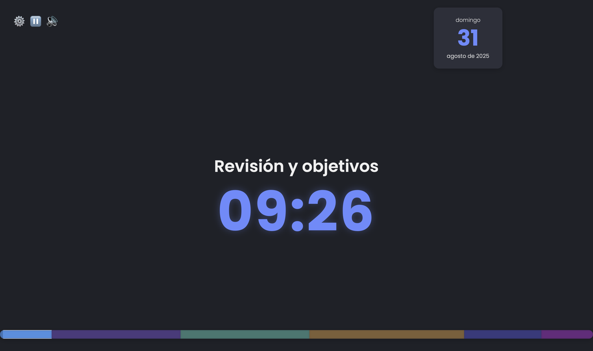

# Classroom Clock

Una aplicación web moderna y personalizable para gestionar el tiempo en bloques durante clases, talleres o presentaciones. Creada para ser proyectada y mantener a todos en la misma página.

## Notas del autor

Idea original de David Torres, desarrollado con gemini de google, guidao mediante prompts, no ha habido ninguna modificación de código durante el proceso, todo ha sido generado por la IA usando mis intrucciones, con el objetivo de probar las capacidades de gemini y a la vez, crear una herramienta para mis clases que asemeja otras alternativas similares online que tienen modelos de suscripción o tienen más opciones de las que me son necesarias.

## ✨ Características

- **Temporizador de Bloques:** Divide tu sesión en bloques de tiempo (teoría, práctica, etc.) con un temporizador de cuenta regresiva claro y visible.
- **Barra de Progreso Visual:** Una barra de progreso en el pie de página muestra todos los bloques de la sesión con colores, resaltando el bloque actual.
- **Control Interactivo:** Salta a cualquier bloque de la sesión simplemente haciendo clic en su segmento correspondiente en la barra de progreso.
- **Pausa y Reanuda:** Controla el flujo del tiempo con un botón para pausar y reanudar el temporizador en cualquier momento.
- **Notificaciones Sonoras:** Tonos sutiles te avisan cuándo un bloque está por terminar y cuándo finaliza. Incluye un control para silenciar (🔇) el audio.
- **Tarjeta de Fecha:** Muestra la fecha actual de forma elegante.
- **Altamente Personalizable:**
  - Haz clic en el icono de engranaje (⚙️) para abrir un completo modal de configuración.
  - **Edita** los nombres, duraciones y colores de cada bloque.
  - **Añade** nuevos bloques a tu sesión.
  - **Elimina** los bloques que no necesites.
- **Gestión de Perfiles:** ¡No pierdas tu configuración!
  - **Guarda y Carga** tu configuración directamente en el navegador (`localStorage`).
  - **Exporta** tu configuración a un archivo `JSON` para tener un respaldo o compartirla.
  - **Importa** una configuración desde un archivo `JSON`.

## 🚀 Cómo Usar

1.  Descarga los archivos (`index.html`, `style.css`, `script.js`).
2.  Abre el archivo `index.html` en tu navegador web preferido (Chrome, Firefox, Edge, etc.).
3.  ¡Listo! El temporizador comenzará con una configuración por defecto.
4.  Haz clic en el icono de engranaje (⚙️) en la esquina superior izquierda para personalizar la sesión a tu gusto.

## 🛠️ Tecnologías Utilizadas

- **HTML5:** Para la estructura de la aplicación.
- **CSS3:** Para el diseño moderno y atractivo, utilizando Flexbox para el layout y variables CSS para el tema.
- **JavaScript (ES6+):** Para toda la lógica interactiva, la manipulación del DOM y la gestión de perfiles.
